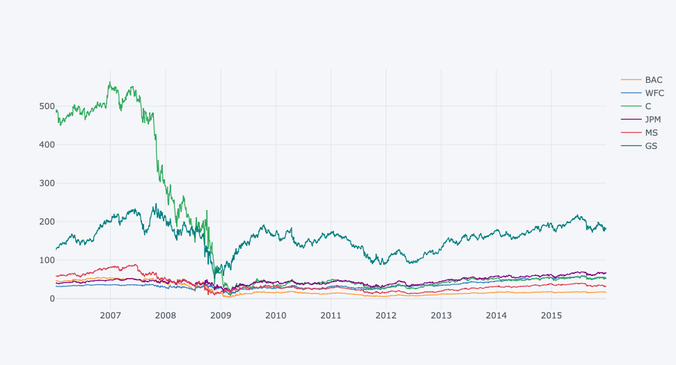

# <h1 align="center"><samp> Bank Stocks Analysis Project </samp></h1>

### Description:
In this project I will analyse the prices of various bank stocks to see how they progressed throughout the [financial crisis of 2007-2008](https://en.wikipedia.org/wiki/Financial_crisis_of_2007%E2%80%9308) all the way to early 2016. The dataset for this project is imported using Yahoo Finance API.

### Data:
Just for reference, [here](https://medium.com/@jouneidraza522/yahoo-finance-api-to-get-stocks-tickers-data-in-python-c49820249a18) is the link on how to use pandas to import data from Yahoo Finance API

### Tools:
* Python
* Numpy
* Pandas
* Matplotlib
* Seaborn
* Plotly
* Cufflinks
